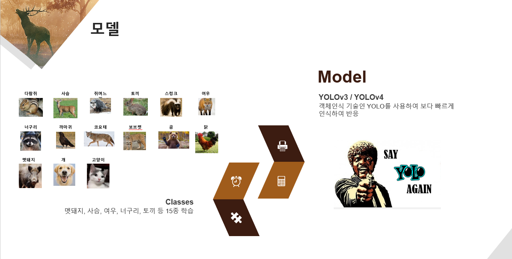
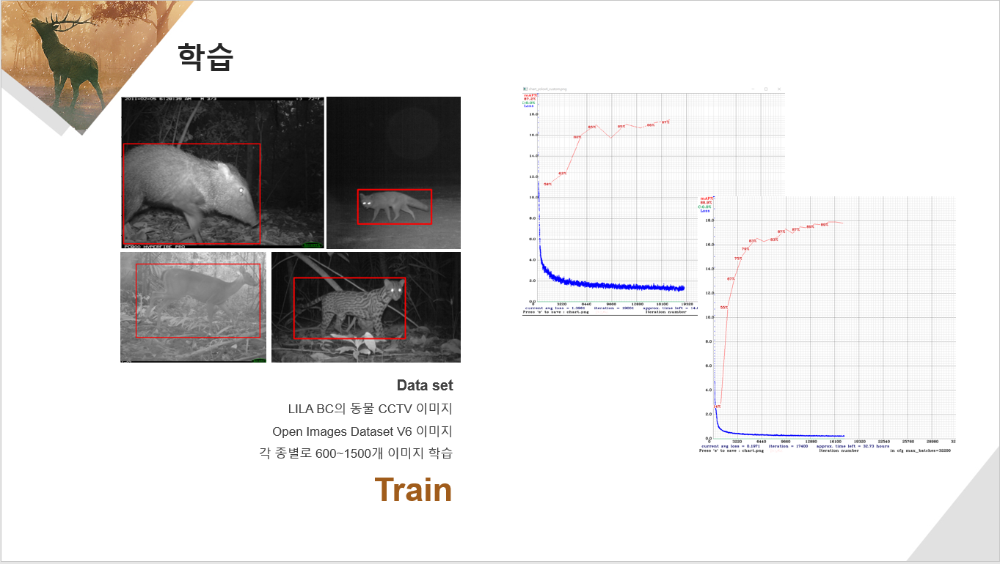
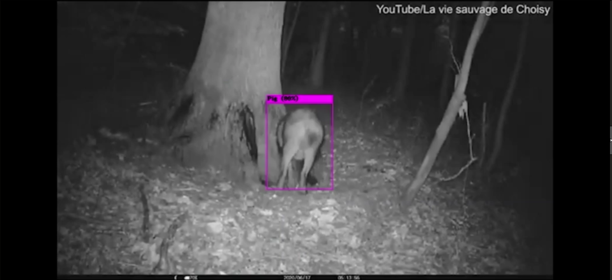
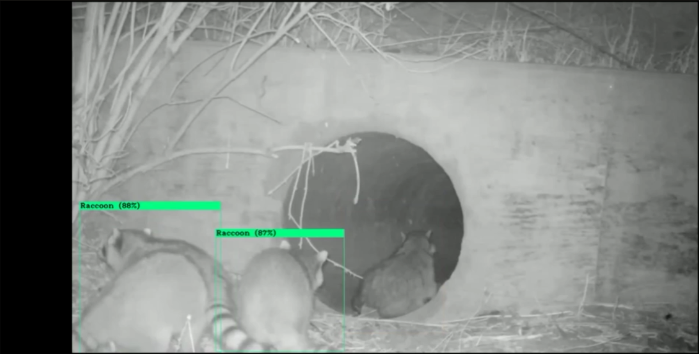

# 광주 인공지능 사관학교 워밍업 프로젝트 - 이미지 분류를 통한 야생동물로 인한 농작물 피해 방지

### 프로젝트 기간: 2020년 9월 8일 ~ 2020년 9월 23일

### 프로젝트 배경: http://www.newsam.co.kr/mobile/article.html?no=13635
매년 100억정도의 피해가 발생하고 있으며, 현재 CCTV를 활용해 야생 동물 감시를 하고 있지만 효과적이지 않은 상황.
기존의 cctv에 이미지 분류를 활용하면 동물들이 나타났을 때, 자동으로 알림이 뜨게하는 기능 추가

### 사용 기술: Yolov3 와 Yolov4 
<ol>
<li>https://pjreddie.com/darknet/yolo/ YoloV3 웹사이트</li>
<li>https://pjreddie.com/media/files/papers/YOLOv3.pdf  Yolov3 논문</li>
</ol>

## 시연 
  
  
  
  

### 어려웠던 점
사실 이미 기술에 대한 설명도 논문으로 나와있고, 구현도 되어있어서 아주 간단한 프로젝트가 될 줄 알았다.
하지만 환경 구축을 하는데 3일이상 걸릴정도로 많은 시간을 썼다. 처음에는 검색했을 때, 대부분 우분투에서 OpenCV 와 CUDA를 설치하길래 따라 했으나, 실패했다. NVIDIA 드라이버, OpenCV 그리고 CUDA는 버전이 자주 바뀌는데 버전이 조금이라도 맞지 않으면 에러가 떴다. 

아래 유튜브 채널에 가면 텐서플로우로 윈도우 환경에서 설치하는데 도움을 받을 수 있다. 
https://www.youtube.com/watch?v=p44G9_xCM4I&list=PLKHYJbyeQ1a0oGzgRXy-QwAN1tSV4XZxg&index=2

시몬님도 이번에 같이 프로젝트를 하며 따로 블로그에 정리를 해두셨다
https://blog.naver.com/simonmatthew/222090665972

### 데이터 출처

https://storage.googleapis.com/openimages/web/index.html
여기에 가면 많은 종류의 데이터와, 필요한 이미지의 박스정보까지 함께 제공된다 

## 논문 정리

이미지 인식은 이렇게 발전해 왔다. 
